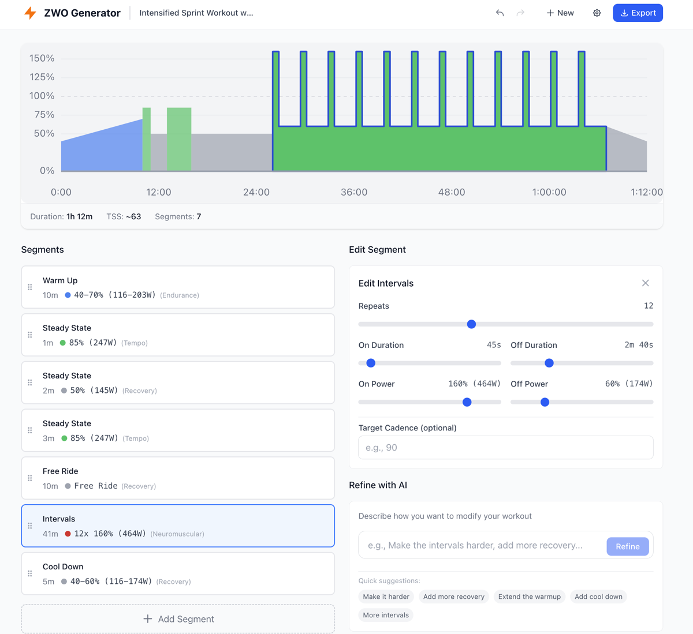
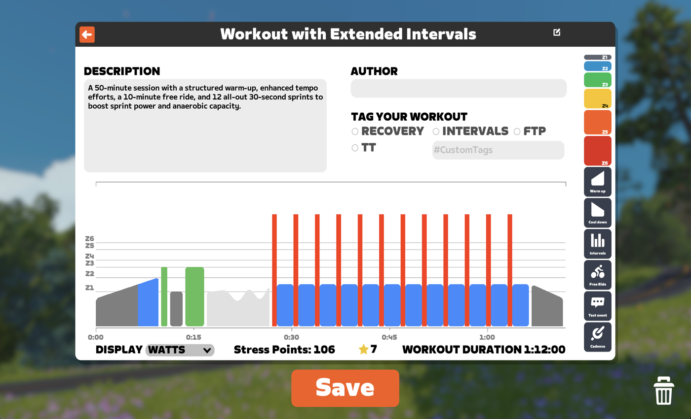

# ZWO Generator

AI-powered Zwift workout generator. Describe your workout in plain English, edit visually, export to ZWO.

**Live:** https://veelenga.github.io/zwo-generator/



## Features

- Generate workouts from natural language using OpenAI
- Visual workout builder with drag-and-drop segments
- Power zone visualization
- Export to Zwift-compatible .zwo files

### In Zwift



## Setup

```bash
npm install
npm run dev
```

Requires an OpenAI API key (entered in app settings).

## Tech Stack

React 19, TypeScript, Vite, Tailwind CSS, Zustand
